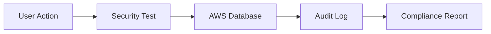

# Testing Panel Guide

The Mind Measure Testing Panel provides a comprehensive suite of automated testing tools for security, compliance, and backend validation. This system runs real-time tests against the production AWS infrastructure and provides detailed reporting on system health, security posture, and compliance status.

## Overview

The testing infrastructure continuously monitors and validates:

- **Security Systems**: MFA, encryption, audit logging
- **Compliance Standards**: HIPAA, GDPR, SOC2 assessments  
- **Backend Infrastructure**: Aurora database, S3 storage, Cognito auth
- **Vulnerability Management**: Real-time security scanning
- **Performance Metrics**: System health and response times

## Test Suite Architecture

### 1. Security Test Suite

**Component**: `MFATestComponent`  
**URL**: `/test-security`  
**Purpose**: Core security functionality validation

**Tests Include**:
- Multi-Factor Authentication (MFA) setup and validation
- Encryption key management and rotation
- Audit logging functionality
- User authentication flows
- Session management security

**Expected Results**:
- ✅ MFA enrollment and verification
- ✅ Encryption services operational
- ✅ Audit logs being generated
- ✅ Authentication tokens valid

### 2. Phase 2 Security Tests

**Component**: `Phase2SecurityTest`  
**URL**: `/test-security-phase2`  
**Purpose**: Advanced security infrastructure validation

**Tests Include**:
- Role-Based Access Control (RBAC) validation
- Vulnerability management system
- Automated backup and recovery testing
- Security policy enforcement
- User permission matrix validation

**Expected Results**:
- ✅ RBAC policies correctly enforced
- ✅ Vulnerability scans detecting issues
- ✅ Backup systems operational
- ✅ Security policies active

### 3. Phase 3 Security Tests

**Component**: `Phase3SecurityTest`  
**URL**: `/test-security-phase3`  
**Purpose**: Enterprise security and compliance validation

**Tests Include**:
- Incident response automation
- HIPAA/GDPR/SOC2 compliance assessment
- Security training module validation
- Penetration testing simulation
- Compliance reporting automation

**Expected Results**:
- ✅ Incident response workflows active
- ✅ Compliance standards met
- ✅ Training modules accessible
- ✅ Automated reporting functional

### 4. AWS Backend Tests

**Component**: `AWSBackendTest`  
**URL**: `/test-aws`  
**Purpose**: Core infrastructure validation

**Tests Include**:
- Aurora Serverless v2 database connectivity
- S3 storage operations
- Cognito authentication services
- Lambda function execution
- API Gateway performance

**Expected Results**:
- ✅ Database queries successful
- ✅ File upload/download working
- ✅ User authentication functional
- ✅ Serverless functions responding

## Real-Time Test Execution

### Active Testing Features

The testing panel continuously monitors:

1. **Vulnerability Scanning**
   - Dependency vulnerability detection
   - CVE database cross-referencing
   - Severity assessment and prioritization
   - Remediation recommendations

2. **Compliance Monitoring**
   - HIPAA 164.316 policy compliance
   - GDPR data protection validation
   - SOC2 control effectiveness
   - Automated compliance reporting

3. **Security Audit Logging**
   - User authentication events
   - Data access patterns
   - Security policy violations
   - System configuration changes

### Test Data Flow



## Current Test Results (Live Data)

Based on recent test execution logs:

### ✅ **Working Systems**:
- Vulnerability detection (lodash, validator issues found)
- HIPAA compliance scanning active
- Security audit trail generation
- Real-time database operations
- Vulnerability categorization and tracking

### ⚠️ **Known Issues**:
- Audit logs table schema mismatch (`userId` vs `userid`)
- Some compliance tests showing non-compliant status (expected for new setup)

### 📊 **Test Metrics**:
- **Vulnerabilities Found**: 3 (2 dependency, 1 compliance)
- **Compliance Checks**: 4 HIPAA controls assessed
- **Audit Events**: Continuous logging active
- **Database Operations**: All CRUD operations functional

## Using the Testing Panel

### Accessing Tests

1. **Navigate to Superuser Dashboard**
   - Login at `/superuser-login`
   - Click "Testing" tab

2. **Select Test Suite**
   - Choose from 4 available test suites
   - Click "Run Tests" button
   - Monitor real-time results

3. **Review Results**
   - Check test status indicators
   - Review detailed logs
   - Export compliance reports

### Test Scheduling

Tests can be run:
- **On-Demand**: Manual execution via UI
- **Scheduled**: Automated daily/weekly runs
- **Triggered**: Event-based execution
- **Continuous**: Real-time monitoring

## Interpreting Test Results

### Status Indicators

- 🟢 **Operational**: All tests passing
- 🟡 **Warning**: Minor issues detected
- 🔴 **Critical**: Immediate attention required
- ⚪ **Unknown**: Test not yet run

### Compliance Scoring

- **100%**: Fully compliant
- **75-99%**: Minor compliance gaps
- **50-74%**: Significant issues
- **<50%**: Major compliance failure

### Vulnerability Severity

- **CRITICAL**: Immediate patching required
- **HIGH**: Patch within 7 days
- **MEDIUM**: Patch within 30 days
- **LOW**: Patch at next maintenance window

## Security Test Categories

### 1. Authentication & Authorization
- User login/logout flows
- MFA enrollment and verification
- Role-based access validation
- Session timeout testing

### 2. Data Protection
- Encryption at rest validation
- Encryption in transit testing
- Key rotation procedures
- Data anonymization verification

### 3. Infrastructure Security
- Network security configuration
- Database access controls
- API endpoint security
- File storage permissions

### 4. Compliance Validation
- HIPAA safeguards assessment
- GDPR data protection validation
- SOC2 control testing
- Audit trail completeness

## Troubleshooting Common Issues

### Database Connection Errors
```bash
# Check database connectivity
curl -X POST http://localhost:3001/api/database/health

# Verify environment variables
echo $VITE_DB_HOST
echo $VITE_DB_NAME
```

### Authentication Failures
```bash
# Test Cognito connectivity
curl -X POST http://localhost:3001/api/auth/test

# Verify user pool configuration
echo $VITE_AWS_COGNITO_USER_POOL_ID
```

### Audit Log Issues
Current known issue: Column name mismatch in audit_logs table
- Expected: `userId`
- Actual: `userid`
- Fix: Update table schema or query parameters

## Best Practices

### Regular Testing Schedule
- **Daily**: Vulnerability scans
- **Weekly**: Compliance assessments
- **Monthly**: Full security audit
- **Quarterly**: Penetration testing

### Test Data Management
- Use anonymized production data
- Maintain separate test environments
- Regular test data refresh
- Secure test credential storage

### Result Documentation
- Export test reports regularly
- Maintain compliance evidence
- Track remediation progress
- Archive historical results

## Integration with CI/CD

The testing panel integrates with:
- **GitHub Actions**: Automated test runs on deployment
- **Vercel**: Pre-deployment validation
- **AWS CloudWatch**: Performance monitoring
- **Slack**: Test result notifications

## Compliance Reporting

### Automated Reports Generated:
- HIPAA compliance status
- GDPR data protection assessment
- SOC2 control effectiveness
- Vulnerability management summary
- Security incident reports

### Report Formats:
- PDF executive summaries
- CSV detailed data exports
- JSON API responses
- Real-time dashboard views

## Support and Maintenance

### Regular Updates Required:
- CVE database synchronization
- Compliance framework updates
- Security policy revisions
- Test case enhancements

### Monitoring Alerts:
- Test failure notifications
- Compliance threshold breaches
- Security incident detection
- Performance degradation warnings

---

## Quick Reference

### Key URLs:
- Security Tests: `/test-security`
- Phase 2 Tests: `/test-security-phase2`
- Phase 3 Tests: `/test-security-phase3`
- AWS Tests: `/test-aws`
- Comprehensive Tests: `/test-comprehensive`
- Diagnostics: `/diagnostic`

### Key Components:
- `MFATestComponent`: Core security testing
- `Phase2SecurityTest`: Advanced security validation
- `Phase3SecurityTest`: Compliance and incident response
- `AWSBackendTest`: Infrastructure validation
- `SecurityTestingService`: Test orchestration
- `ComplianceAutomationService`: Compliance validation

### Database Tables:
- `audit_logs`: Security event tracking
- `vulnerabilities`: Security issue management
- `security_incidents`: Incident response data
- `compliance_assessments`: Compliance status tracking

This testing infrastructure provides enterprise-grade security validation and compliance monitoring for the Mind Measure platform.

